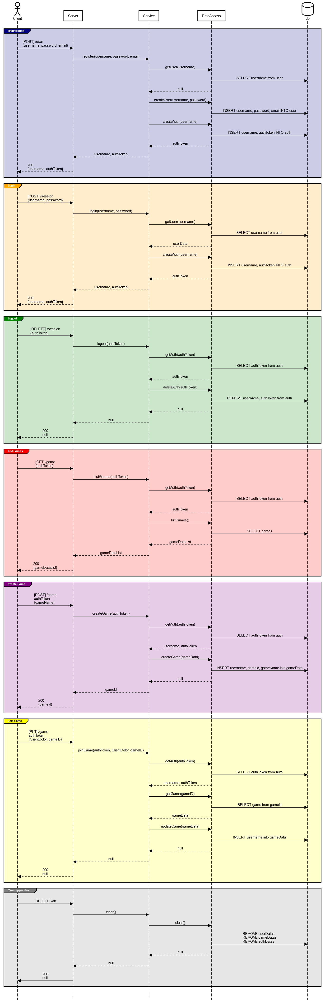

# ♕ BYU CS 240 Chess

This project demonstrates mastery of proper software design, client/server architecture, networking using HTTP and WebSocket, database persistence, unit testing, serialization, and security.

## 10k Architecture Overview

The application implements a multiplayer chess server and a command line chess client.

[](https://sequencediagram.org/index.html#initialData=C4S2BsFMAIGEAtIGckCh0AcCGAnUBjEbAO2DnBElIEZVs8RCSzYKrgAmO3AorU6AGVIOAG4jUAEyzAsAIyxIYAERnzFkdKgrFIuaKlaUa0ALQA+ISPE4AXNABWAexDFoAcywBbTcLEizS1VZBSVbbVc9HGgnADNYiN19QzZSDkCrfztHFzdPH1Q-Gwzg9TDEqJj4iuSjdmoMopF7LywAaxgvJ3FC6wCLaFLQyHCdSriEseSm6NMBurT7AFcMaWAYOSdcSRTjTka+7NaO6C6emZK1YdHI-Qma6N6ss3nU4Gpl1ZkNrZwdhfeByy9hwyBA7mIT2KAyGGhuSWi9wuc0sAI49nyMG6ElQQA)

## Server Diagram
[](https://sequencediagram.org/index.html?presentationMode=readOnly#initialData=IYYwLg9gTgBAwgGwJYFMB2YBQAHYUxIhK4YwDKKUAbpTngUSWOZVYSnfoccKQCLAwwAIIgQKAM4TMAE0HAARsAkoYMhZkwBzKBACu2GAGI0wKgE8YAJRRakEsFEFIIaYwHcAFkjAdEqUgBaAD4WakoALhgAbQAFAHkyABUAXRgAej0VKAAdNABvLMpTAFsUABoYXCl3aBlKlBLgJAQAX0wKcNgQsLZxKKhbe18oAAoiqFKKquUJWqh6mEbmhABKDtZ2GB6BIVFxKSitFDAAVWzx7Kn13ZExSQlt0PUosgBRABk3uCSYCamYAAzXQlP7ZTC3fYPbY9Tp9FBRNB6BAIDbULY7eRQw4wECDQQoc6US7FYBlSrVOZ1G5Y+5SJ5qBRRACSADl3lZfv8ydNKfNFssWjA2Ul4mDaHCMaFIXSJFE8SgCcI9GBPCTJjyaXtZQyXsL2W9OeKNeSYMAVZ4khAANbofWis0WiG0g6PQKwzb9R2qq22tBo+Ew0JwyLGqaVc0+m3oAOUIPwZDoMBRABMAAY03lClceRGLb70O10DJNDp9IYjNBeMcYB8IHY3EYvD4-ImgsHWKG4olUhkVFIXGgs9zTXy6u0Q90O+ivQh60g0OrwzMatSA1KZa6IsczhcRygtXdXbqmeRPt8uTmykCQcbndrj+7gpKvRNbuvxE9Nw95fjfMrVSXTV7yPaEQj1NkOUvUlTUjS1ozcEUxTgkDsTdD0ZwRb14L9D9VCfXpQ33PMo1wycg38JNUwzYcr2mOCCzQIs0BLbRdAMYwdBQO06y0fRmCbbxfEwSj20IqAomiPhzySN40nSfsJEHLMGIQidOygEIXwROc+JVUZVL9dZtJCb9Dh3AC1UM9BDzQ8CmXeL4fmwxibwgUEULMiQn20qJrP9Ezgi8iIZBQBAThQSyDPzBDbNleyIisN4AFl4gANTeMNcxchC3I8p0vJ8z0ESRFE8KKroIlK1FJyfUTk3TTM0GqzBi1LdiK0GGRa2GGAAHEeUeQSWxEttmAwmgJJiPq3l7dItB5FSYr9dSugZXyPmGAaygkaLSJs8qgpdH8LItPacIOwrgheRyLxyv08uw1D4q04q-OWmNAuC5AHG2yRRji10Etu5yFp256gdezDtx5W5NoccqocmmGyjh4ZY00kJ6oiRqszBlA0YcdpWpY9ry2MbA9CgbBwvgP9VD+jwhNbAJxunZGYgSZJ5PxvJ-LxnlWR5VbJvWt6FQJP7zsY4zitM47zJOKL-MBh5gfPZz-MezyFe8pH2CiYj7s+uWjofH8Jd8KX8duVWpASyDDWgk1pnx5lFnxoXrwXSAYBt+QIbV-X+hakykciN2S1qrGxpxmiCkj5jWLLDijHMMK53cGAACkIAXfqeWMBQEFAa1RtZsXKs5045t50wPqHAp6rgCA5ygSo3b4EW4wmg2ACs87QKX-MqZvW+gDueWZPhZcw+XzcVsBlYbu3vOuhyNd+LXgXcp7CuDrCjf8w7gp3a2p5nwP7fXiIQd+fHHsjq+9efN7-aEE-dYiAw5CtnlRnfsAVeDsDRGn3DAH2EA-awwDvvV+0NQ5y3DhJRBXQ6qx1xs1ZEqI2psXJkYHQwBLCIEVLAYA2AaaEGcK4JmI16qVw5lJGSckMjqAxgfCIIBwp4ABp-BecouGkN4VdF4SVUoZWNLcCQeQxHpUyoA6RaBZESLglI5+FV4RVWwYjeByNUGTRjqzOOTUWptSAA)

## IntelliJ Support

Open the project directory in IntelliJ in order to develop, run, and debug your code using an IDE.

## Maven Support

You can use the following commands to build, test, package, and run your code.

| Command                    | Description                                     |
| -------------------------- | ----------------------------------------------- |
| `mvn compile`              | Builds the code                                 |
| `mvn package`              | Run the tests and build an Uber jar file        |
| `mvn package -DskipTests`  | Build an Uber jar file                          |
| `mvn install`              | Installs the packages into the local repository |
| `mvn test`                 | Run all the tests                               |
| `mvn -pl shared tests`     | Run all the shared tests                        |
| `mvn -pl client exec:java` | Build and run the client `Main`                 |
| `mvn -pl server exec:java` | Build and run the server `Main`                 |

These commands are configured by the `pom.xml` (Project Object Model) files. There is a POM file in the root of the project, and one in each of the modules. The root POM defines any global dependencies and references the module POM files.

### Running the program using Java

Once you have compiled your project into an uber jar, you can execute it with the following command.

```sh
java -jar client/target/client-jar-with-dependencies.jar

♕ 240 Chess Client: chess.ChessPiece@7852e922
```
